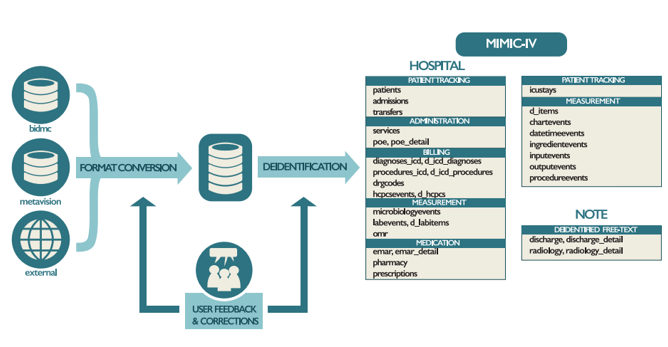

Guía para instalar MIMIC IV en PostgreSQL utilizando contenedores de Docker en Windows
=================

### Autores

| Autor                      | Origen                               |
| -------------------------- | ------------------------------------ |
| Emmanuel Gutiérrez Jiménez | Universidad del Norte                |
| José Duván Márquez Díaz    | Universidad del Norte                |
| Ana Lucila Sandoval        | Universidad Complutense de Madrid    |

### Créditos

Este tutorial es adaptado del entregado por los creadores de MIMIC-IV en: https://mimic.physionet.org/tutorials/

### Resumen

Este repositorio proporciona una guía práctica y reproducible para la instalación del conjunto de datos clínicos MIMIC-IV en una base de datos PostgreSQL utilizando Docker. Está diseñado para facilitar el despliegue local del entorno de análisis, especialmente para investigadores, científicos de datos y profesionales de la salud interesados en explorar información crítica de pacientes hospitalizados. La guía incluye la configuración del contenedor de base de datos, la carga automatizada de los archivos CSV de MIMIC-IV y recomendaciones para el acceso eficiente a los datos desde herramientas analíticas como Python, R o Jupyter. El objetivo principal es acelerar la preparación del entorno de trabajo para investigaciones en salud, machine learning y análisis clínico reproducible.

 
  
  Fuente: (Johnson, y otros, 2023)

### Estado del trabajo 

| Estado            | Descripción                          |
| ----------------- | ------------------------------------ |
|  | Trabajo finalizado. | 

### Palabras claves

- `MIMIC-IV`
- `PostgreSQL`
- `Docker`
- `Dataset Patients`
- `Predictive Models`
- `CSV`

### Requerimientos previos

- Equipo con instalación de Windows 11 Profesional Edition o Windows Server 2019 en adelante.
- Tener conocimientos de instalación de servidores en contenedores de Docker.
- Tener conocimientos en ejecución de scripts en bases de datos PostgreSQL.
  
### Paso 1. Descargar los archivos CSV desde el sitio oficial de MIMIC-IV

Para poder descargar los archivos CSV de la base de datos de MIMIC-IV, primero debes solicitar permiso para usar MIMIC-IV en: https://mimic.physionet.org/gettingstarted/access/.

Si ya tienes permisos para descargar los archivos CSV de la base de datos de MIMIC-IV, entocnes ves a la página oficial de MIMIC-IV: https://physionet.org/content/mimiciv/3.1/ y descarga el .zip que contiene todos los CSV de cada una de las tablas de la base de datos.

### Paso 2. Instalar docker en Windows

Descarga Docker desde el sitio oficial en: https://docs.docker.com/desktop/setup/install/windows-install.

### Paso 3. Instalar contenedores de Postgres y Jupyter

#### Paso 3.1. Crear workspace en Visual Studio Code
#### Paso 3.2. Crear Docker-Composer.yml
#### Paso 3.3. Ejecutar creación de contenedores desde Visual Studio Code

### Paso 4. Configuración de la base de datos

#### Paso 4.1. Conectarse a Postgres
#### Paso 4.2. Crear base de datos: mimiciv
#### Paso 4.3. Crear schema: mimiciv
#### Paso 4.4. Crear tablas dentro del schema: mimiciv

### Paso 5. Importar CSV en tablas de la base de datos

#### Paso 5.1. Importar tablas de CORE
#### Paso 5.2. Importar tablas de ICU
#### Paso 5.2. Importar tablas de HOSP

### Paso 6. Crear indices en las tablas de la base de datos para mejorar el desempeño de las consultas sql

### Paso 7. Verificar el contenido de las filas en cada una de las tablas

